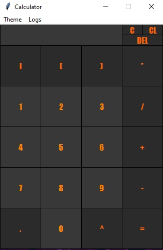
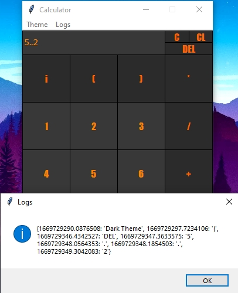

# Логика рассчетов программы

1. Пользователь с помощью мыши нажимает на кнопки, тем самым вводя символы в поле ввода

2. При нажатии на знак `=` программа считывает все содержимое поля ввода в окне.

3. Производится первичная проверка: 

    1. Если знак `=`, до этого нажатия был нажат, то поле ввода сбрасывается и в него помещается результат предыдущих рассчетов, затем можно продолжать работу

    |Нажата в первый раз|Нажата второй раз|
    |:-------------------:|:-----------------:|
    |||

    2. Если знак `=` не был нажат до этого, то выполняется функция `btn_equal_clicked`
## Button_equal_clicked

4. В переменную `expression` помещается вся строка, которая была в поле ввода

5. Происходит ряд проверок: 
    1. Есть ли в тексте несколько операторов подряд, например `+-`, с помощью функции `ops_checker`

        

    2. Не пропустил ли пользователь знак между скобкой и числом, например `56(9-3)`, с помощью функции `ops_checker`

        

    3. Не стоит ли в выражении несколько точек подряд, с помощью функции `dot_checker_prev`

        

    В случае не прохождения проверки выполняется остановка выполнения функции `button_equal_clicked`

6. С помощью регулярных выражений происходит разделение строки на список, где в одной ячейке может оказаться:
    * Число
    * Символ
    * Символ и число, в случае, если этот символ `i` или `.`

    Происходит еще один ряд проверок:
    
    1. Количество открывающих скобок = количеству закрывающих скобок, с помощью функции `bracket_checker`

        

    2. Не ввел ли пользователь больше одного символа `i` подряд,с помощью функции `complex_checker`

        

    3. Заключено ли комплексное число в круглые скобки, с помощью функции `complex_checker`

        

    4. Не присутствует ли в выражении одинокая точка без чисел, с помощью функции `dot_checker`

        

    В случае не прохождения проверки выполняется остановка выполнения функции `button_equal_clicked`

8. Выполняется конвертация всех введенных числе в комплексные, с помощью функции `complex_converter`

9. C помощью функций `bracket_calc` и `bracket_finder` производится рассчет выражений внутри всех скобок. `bracket_dinder` ищет последнюю открывающую скобку и первую следующей за ней закрывающую. `bracket_calc` считает выражение внутри скобок с индексами, полученными из `bracket_finder` с помощью функции `calc_func`, где прописана логика рассчета, в зависимости от одного из операторов: `+ - / * ^`, причём сначала выполняются все действия, связанные с возведением в степень, затем с умножением или делением и лишь затем со сложением или вычитанием. Так же в функцию `calc_func` внедрена проверка деления на 0, в случае его прекращается действие функций в следующей последовательности: `calc_func bracket_calc btn_equal_clicked`

10. С помощью функции `main_calc` по аналогии с `bracket_calc` выполняются все действия в выражении, которое уже не содержит скобок, а содержит результат их выполнения

11. Мнимая и действительная части результата округляются и выводятся на экран вместе со знаком равенства

    

PS. В случае непрохождения проверки приостанавливается работа лишь `btn_equal_clicked`, само приложение продолжает работу, так же всплывает предупреждающее окно, которое информирует об ошибке.

# Визуальная часть калькулятора

Создаётся окно, опреденного размера, которое нельзя расширить. Окно содержит в себе:
1. Меню сверху, где можно выбрать цветовое оформление или произвести определенные действия с логами

|Dark theme|Light Theme|
|:---:|:---:|
||

|Theme|Logs|
|:---:|:---:|
||

2. Кнопки цифр и спецсимволов, таких как `i` и `.`
3. Кнопки операторов
4. Кнопка стирания одного символа `DEL`

    |До|После|
    |:---:|:---:|
    ||

5. Кнопка очистки всего поля ввода `C`

    |До|После|
    |:---:|:---:|
    ||

6. Кнопка очистки несохраненных логов `CL`

    |До|После|
    |:---:|:---:|
    ||

7. Некликабельное поле ввода, для защиты от ввода посторонних символов

При нажатии на кнопку цифр или операторов выполняется функция `btn_"имя кнопки"_clicked`, которая вставляет в поле ввода символ, соответствующий кнопке на место положения указателя. (исключение - кнопка `=`)

# Логирование

Для работы с логами представлен файл `LOGS.json`
Логи хранятся в словаре, где структура одного лога такова: `Время в секундах с начала "кЭомпьютерной эпохи":действие`. Не самый удобный формат записи, но так сделано не случайно: при нажатии нескольких кнопок в течение одной секунды лог будет перезаписан, соответственно предыдущее действие утеряно. Изначально все логи не сохранены в файл json, для сохранения есть отдельная команда
В случае не прохождения проверки, при нажатии кнопки `=` так же происходит логгирование:

* Если проверка не была пройдена до стадии сплита строки, то в лог запишется `warn0`

    |До нажатия на `=`|После нажатия на `=`|
    |:---:|:---:|
    ||
    
* Если проверка не была пройдена после стадии сплита строки до начала вычислений, то в лог запишется `warn1`

    |До нажатия на `=`|После нажатия на `=`|
    |:---:|:---:|
    ||
    
* Если проверка не была пройдена во время вычислений(деление на ноль), то в лог запишется `warn2`

    |До нажатия на `=`|После нажатия на `=`|
    |:---:|:---:|
    ||

В меню вверху есть отдельный пункт Logs, которые содержит в себе три команды:

* Export logs - выгружает несохраненные логи в файл `LOGS.json` с помощью объединения словарей

    |До экспорта|После экспорта|
    |:---:|:---:|
    |||

* Show logs - показывает текущие(временные) логи

    

* Clear external log storage - очищает файл `LOGS.json`

    |До чистки|После чистки|
    |:---:|:---:|
    |||

